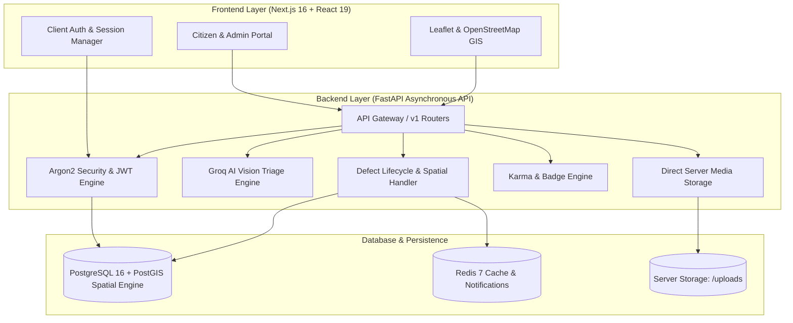

<div align="center">

# 🏙️ FIXORA
### *AI-Powered Civic Defect Intelligence & Municipal Resolution Platform*

**Report. Verify. Resolve.**  
Bridging the gap between active citizens and municipal corporations through automated AI defect triage, geospatial intelligence, and community-driven verification.

---

[](https://fastapi.tiangolo.com)
[](https://nextjs.org/)
[](https://www.postgresql.org/)
[](https://groq.com)
[](https://www.typescriptlang.org/)
[](https://tailwindcss.com/)
[](LICENSE)

</div>

---

## 📌 The Problem We Are Solving

In rapidly urbanizing areas, public infrastructure defects—such as hazardous potholes, non-functional streetlights, open manholes, water main leaks, and illegal garbage dumping—frequently go unnoticed or take months to resolve.

### Core Roadblocks in Today's Urban Governance:
1. **Reporting Friction & Ambiguity**: Citizens are discouraged by complex government portals, multi-tier bureaucracy, and having to guess which department handles their specific problem.
2. **Duplicate Tickets & Spam Overload**: When a major pothole forms on a busy street, dozens of citizens file separate complaints. Municipal offices drown in unorganized, duplicate tickets without accurate GPS context.
3. **Ghost Resolutions**: Municipal tickets are frequently marked "Closed" or "Resolved" on paper to hit performance metrics, without physical verification or citizen confirmation.
4. **Lack of Civic Motivation & Feedback**: Citizens feel ignored because there is no tracking transparency, status notifications, or recognition for being proactive community members.

---

## 💡 How Fixora Solves The Problem

Fixora transforms civic complaint management into an automated, transparent, and community-verified ecosystem:

```
[ Citizen Takes Photo ] 
         │
         ▼
[ Groq AI Vision Engine ] ──► Auto-detects Defect Category, Severity (1-5), & Responsible Department
         │
         ▼
[ PostGIS Spatial Check ] ──► Detects if already reported within 35m:
         │                    ├─► If Yes: Increments report counter & boosts ticket priority (No duplicate spam)
         │                    └─► If No:  Creates new defect ticket + awards Karma to citizen
         ▼
[ Community Verification ] ──► Neighbors verify defect on-site; auto-upgrades status to VERIFIED
         │
         ▼
[ Municipal Action & Proof ]─► Field workers fix defect & upload resolution evidence
         │
         ▼
[ Citizen Confirmation ] ────► Citizen / Community confirms fix before ticket is officially closed
```

1. **Sub-Second AI Defect Triage**: Citizens simply upload or snap a photo of the defect. Fixora's AI automatically analyzes the visual evidence, classifies the category, assigns a severity score (1–5), writes a detailed description, and routes it to the right department.
2. **Smart Duplicate Detection & Defect Counting**: Using PostGIS spatial geography queries (`ST_DWithin` with a 35-meter threshold), Fixora checks if a defect of the same type was already reported nearby. Instead of creating redundant spam tickets, it automatically increments the report counter (`report_count = 2, 3...`) and boosts the ticket's priority score.
3. **Community Proof-of-Truth**: Ward residents corroborate issues directly from their smartphones. When 3 residents verify an issue on-site, it auto-upgrades to `VERIFIED`.
4. **Transparent Resolution Audit Trail**: Municipal teams submit proof of work, and tickets remain in review until citizens physically confirm the fix.
5. **Civic Gamification**: Citizens earn Karma points, level up, and unlock achievement badges for actively participating in local civic maintenance.

---

## 🏗️ System Architecture



---

## 📁 Project Folder Structure & Module Breakdown

Below is the directory architecture of Fixora detailing every folder and its specific function:

```
sppl/
│
├── backend/                        # High-performance asynchronous FastAPI backend
│   ├── app/
│   │   ├── api/
│   │   │   └── v1/
│   │   │       ├── api.py          # Master API router uniting all v1 service endpoints
│   │   │       └── endpoints/      # REST API route controllers
│   │   │           ├── auth.py     # User registration, OAuth2 JWT login, and profile fetching
│   │   │           ├── issues.py   # Defect reporting, spatial nearby search, AI triage, and status updates
│   │   │           ├── admin.py    # Municipal officer dashboard, defect triage, and crew assignment
│   │   │           ├── gamification.py # Civic Karma leaderboard, user statistics, and badge awards
│   │   │           └── notifications.py# Real-time citizen and municipal notification alerts
│   │   │
│   │   ├── core/
│   │   │   ├── config.py           # Application settings, CORS policies, and configuration management
│   │   │   ├── database.py         # Async SQLAlchemy engine and session lifecycle manager
│   │   │   └── security.py         # Argon2 cryptographic password hashing and JWT token handlers
│   │   │
│   │   ├── models/                 # SQLAlchemy ORM models (PostgreSQL tables)
│   │   │   ├── user.py             # User accounts, role-based access control (CITIZEN, ADMIN, WORKER)
│   │   │   ├── issue.py            # Core defect table, PostGIS coordinates, report count, status lifecycle
│   │   │   ├── ward.py             # Municipal administrative wards and spatial polygon boundaries
│   │   │   ├── department.py       # Municipal agencies (Roads, Water, Electricity, Sanitation)
│   │   │   ├── verification.py     # Peer-verification votes and on-site geolocation validation
│   │   │   ├── timeline.py         # Complete immutable audit log of status transitions
│   │   │   ├── badge.py            # Civic badges and achievement unlock tracking
│   │   │   ├── confirmation.py     # Community confirmation before ticket closure
│   │   │   └── notification.py     # Push notifications for citizens and ward officers
│   │   │
│   │   ├── schemas/                # Pydantic v2 data transfer schemas
│   │   │   ├── user.py             # User inputs, login validation, and profile responses
│   │   │   ├── issue.py            # Issue creation, spatial search, and AI triage schemas
│   │   │   ├── admin.py            # Dashboard metrics, triage queues, and assignment requests
│   │   │   ├── gamification.py     # Leaderboard tables and badge response schemas
│   │   │   └── notification.py     # Notification feeds and mark-as-read payloads
│   │   │
│   │   └── services/               # Core business logic services
│   │       ├── groq_ai.py          # Groq AI image analysis, defect categorization, and description generator
│   │       ├── server_storage.py   # Direct server file uploads for defect photo evidence
│   │       └── notifications.py    # Notification dispatcher for nearby ward residents
│   │
│   ├── alembic/                    # Database schema migration files
│   ├── uploads/                    # Local storage repository for before/after evidence photos
│   ├── main.py                     # FastAPI application entrypoint and middleware configuration
│   ├── requirements.txt            # Python dependencies
│   └── docker-compose.yml          # PostgreSQL 16 (PostGIS) and Redis 7 container configuration
│
├── frontend/                       # Next.js 16 App Router web application
│   ├── src/
│   │   ├── app/                    # Next.js pages and application routes
│   │   │   ├── page.tsx            # Home landing page with 3 quick-action doors (Report, Explore, Track)
│   │   │   ├── report/page.tsx     # 3-step reporting wizard with live AI auto-write & location picker
│   │   │   ├── explore/page.tsx    # Interactive full-screen map with filtering and defect cards
│   │   │   ├── track/page.tsx      # Real-time defect tracker, audit timeline, and 1-click issue selector
│   │   │   ├── dashboard/page.tsx  # Citizen personal hub (reported defects, verified issues, karma)
│   │   │   ├── leaderboard/page.tsx# Public civic hero rankings and unlocked achievement badges
│   │   │   ├── admin/page.tsx      # Municipal administration portal (triage queue, assignment, status flow)
│   │   │   ├── login/page.tsx      # Secure sign-in page
│   │   │   ├── register/page.tsx   # Citizen account registration page
│   │   │   ├── globals.css         # Tailwind CSS styling and theme configuration
│   │   │   └── layout.tsx          # Master root layout with navigation and authentication provider
│   │   │
│   │   ├── components/             # Reusable UI components
│   │   │   ├── admin/AdminGuard.tsx# Role-based route guard protecting administrative screens
│   │   │   ├── map/                # SSR-safe Leaflet mapping components (zero API keys required)
│   │   │   │   ├── LeafletLocationPicker.tsx # Drag-and-drop location picker with reverse geocoding
│   │   │   │   ├── LeafletMiniMap.tsx        # Compact read-only map for defect cards
│   │   │   │   └── LeafletCityMap.tsx        # City/ward-wide interactive defect map
│   │   │   ├── notifications/      # Real-time notification bell and alert dropdown
│   │   │   └── resolution/         # Before & After dual-image proof comparison cards
│   │   │
│   │   └── lib/                    # Client infrastructure utilities
│   │       ├── api-client.ts       # Typed HTTP client with automatic JWT bearer handling
│   │       ├── auth-context.tsx    # React authentication context for global session management
│   │       └── constants.ts        # Civic issue categories, severity badges, and status configurations
│   │
│   ├── public/                     # Static assets and icons
│   ├── package.json                # Frontend packages and scripts
│   └── tsconfig.json               # TypeScript configuration
│
└── md/                             # In-depth architectural documentation
    ├── prd.md                      # Product Requirements Document
    ├── tech_stack.md               # Technical decisions and engineering trade-offs
    └── database_architecture.md    # Complete relational database schemas and ERD
```

---

## ⚙️ Technology Stack Overview

| Layer | Technology | Purpose |
| :--- | :--- | :--- |
| **Backend API** | FastAPI (Python 3.11+) | Asynchronous high-concurrency REST API |
| **Database** | PostgreSQL 16 + PostGIS | Spatial geometry queries & transactional persistence |
| **Caching & Queue** | Redis 7 | High-speed cache and notification dispatch |
| **AI Vision & Triage** | Groq AI (`openai/gpt-oss-120b`) | Rapid image classification, severity rating, and description generation |
| **Frontend Framework** | Next.js 16 (React 19, TypeScript) | Responsive App Router web interface |
| **Styling** | Tailwind CSS v4 | Utility-first, mobile-responsive styling |
| **Mapping Engine** | OpenStreetMap + Leaflet.js | 100% open-source spatial maps with zero API keys or watermarks |
| **Authentication** | Argon2 + Python-Jose | Cryptographic password hashing and stateless JWT tokens |
| **Media Storage** | Direct Server Disk Storage (`/uploads`) | Cost-effective, zero-dependency photo evidence storage |

---

<div align="center">

**Built with ❤️ for Smarter, Cleaner, and Safer Cities.**  
*Fixora — Empowering Citizens, Accelerating Governance.*

</div>
